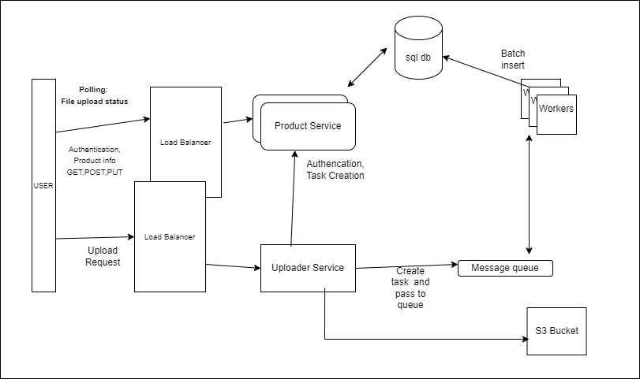

# 🚀 Project Documentation
## 📌 Question
Design and implement a web application that would allow users to:

Functional Requirements
•	Upload and persist pricing feeds from retail stores using CSV files which contain Store ID, SKU, Product Name, Price, Date
•	Search for pricing records using various criteria and be able to edit/save changes to any record
Non-Functional Requirements
•	Standard set of non-functional requirements you would expect a retail stores chain with 3000 stores across multiple countries

Please feel free to choose the technology stack and frameworks you are comfortable with and implement a single page web application. 

Expected Deliverables:
•	Context Diagram
•	Solution Architecture
•	Design Decisions
•	Non-functional requirements considered and how the design addresses them
•	Assumptions
•	Source for the implementation

Upload the artifacts and source to your Github repository and include a reference to it as part of the response.

## 📌 Architecture Diagram


## 📖 Questions & Answers

##### 1. Context Diagram


#####  2. Solution Architecture
- **Frontend:** React + Vite SPA for user interaction.
- **Backend Services:**
  - Product Management Service (FastAPI) for CRUD operations.
  - Uploader Service to handle CSV uploads.
  - Worker Service for asynchronous processing via RabbitMQ.
- **Database:** Considering we will will upload and show all the product information- Any sql database seems good choice.We have incorporate proxy servers to manage connection polling. PostgreSQL with PgBouncer for connection pooling.
- **Message Queue:** RabbitMQ/AWS message queue to manage  tasks.
- **Docker & Compose:** For containerized deployment.
- **Storage:** Object storage (s3)
- **Cloud services:**  AWS/Azure
#####  3. Design Decisions
- **Backend**:
    - **Microservices Approach:** Separation of concerns between product management, upload handling, and task processing.
    - **Batch Insert Strategy:** To efficiently handle large CSV uploads.
    - **Message Queue (RabbitMQ/AWs message ):** Ensures non-blocking request processing.
    - **Connection Pooling (PgBouncer):** Prevents database overloading.
    - **Storage:** Object staorage like (s3)
- **Frontend **:
    - As the list could grould we are using **react-virtualized** to make render efficiently
    - We have use polling to get task status from user.Here in the implementation predefined polling every 1 second max of 10 time.This can be changed or optimized based on file size.

#####  4. Non-Functional Requirements & Considerations
- **Scalability:**
    -  Message queue allows task distribution across multiple worker instances.Can be configured to handle failure cases.
    - The microservices are **State less** then can be scaled horizontaly.This approach make the backend handle data from 3000 stores
    - we have separate services to handle specific function.Uploader and worker process can be scalled according to our load
    - Polling :One important thing after upoload will be knowing status.We have decided to go with **Polling**(Long or Short).Major reson to avoid Websocket or Server sent event is we don't need real time status .And managing connection very difficult if system scale.
- **Performance:** Batch insert reduces database write overhead.
- **availability :**: Can use AWS services for 99.99% availability


#####  5. Assumptions
- we will **delete** the file after upload(Can be extended to storage in archive and use different  lifecycle policy)
- Assumption is each of the 3000 stores upload the feed once or twice daily.Each store have max 1 or two users (Manager)to access the webisite daily
- It is fine for user to wait for status of the file upload. As for large file it could take time for upload.
- Frontend will be used for *read heavy operation  write heavy*


##### 6. Source of Implemention
 - **Used chatGPT for following:**
    -  Boilerplate code generation (FastAPI, React, Docker setup, etc.)
    - Writing documentation and configuration scripts


#####  5. Scope to improve
- Use AWS self managed  services for this development .It handle lot of burden of manageing queue,handling edge cases.And Gurantee availability.
- can use AWS lambda instead of running in servers (EC2)
- Use read replica of database for most of the read queries. This will be very efficient when lot of file upload processed.
# 🚀 Project Setup & Usage

## Prerequisites
- **Docker** installed on your system
- **Docker Compose** installed

## Services
This project consists of the following services:
- **PostgreSQL Database (`db`)**: Stores application data.
- **PgBouncer (`pgbouncer`)**: Connection pooling for PostgreSQL.
- **RabbitMQ (`rabbitmq`)**: Message broker for asynchronous tasks.
- **Product Management Service (`product-management-service`)**: Backend service managing products.
- **Uploader Service (`uploader-service`)**: Handles file uploads.
- **Worker Service (`workers`)**: Processes queued tasks.
- **Frontend (`frontend`)**: React + Vite application for UI.

## Running the Project
To build and start the project, run:
```sh
docker-compose up --build
```

## Database Access
### Check Available Tables
```sh
docker exec -it postgres_db psql -U product -d product -c "\dt"
```

### Connect to Database
```sh
docker exec -it postgres_db psql -U product -d product
```

## Task Status Management
To check the **task status**, run the following SQL command:

### Insert Default Task Statuses (if table is empty)
```sql
INSERT INTO task_status (id, status_name)
VALUES
    (1, 'pending'),
    (2, 'processing'),
    (3, 'completed'),
    (4, 'failed');
```

## RabbitMQ Management
### Access RabbitMQ Web UI
RabbitMQ has a web-based management interface:
- **URL:** [http://localhost:15672](http://localhost:15672)
- **Username:** `guest`
- **Password:** `guest`

### List Queues
To check available queues in RabbitMQ:
```sh
docker exec -it rabbitmq rabbitmqctl list_queues
```

## Running the Frontend
To start the **Vite-based frontend**, run:
```sh
docker-compose up frontend
```

Once running, access the frontend at:
- **URL:** [http://localhost:5173](http://localhost:5173)

## Notes
- Ensure **PostgreSQL** is running before executing database commands.
- Use `docker-compose logs -f` to monitor the application logs.

